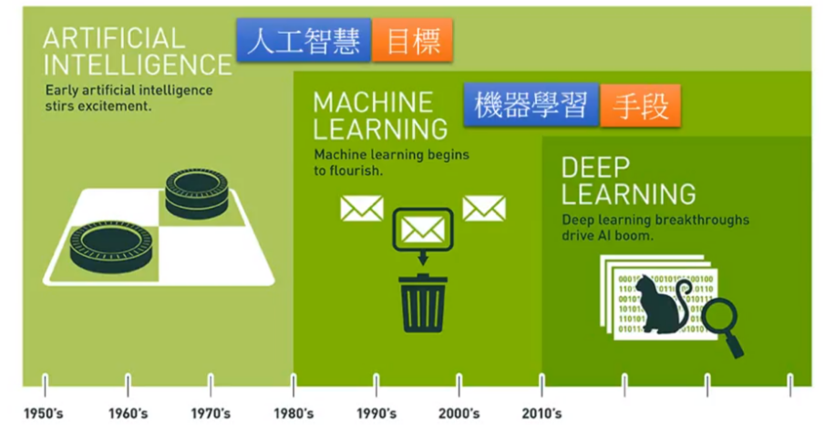
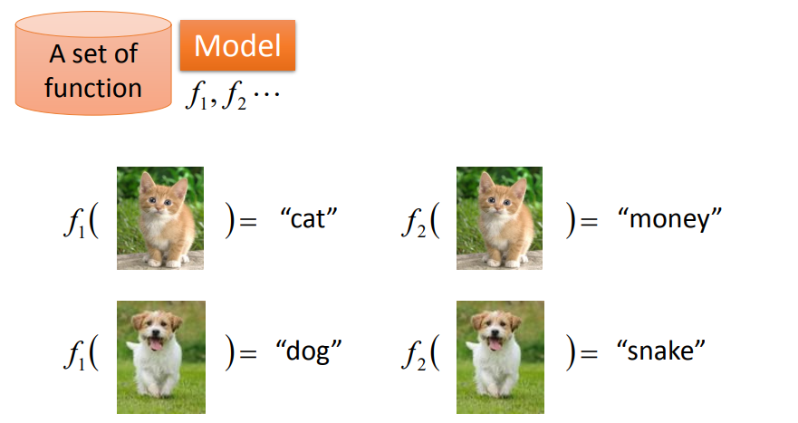
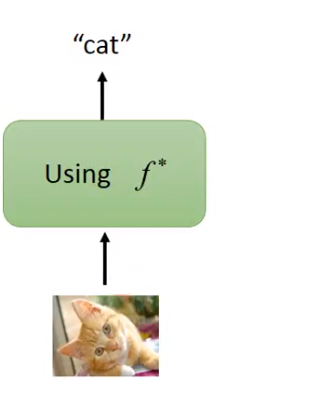
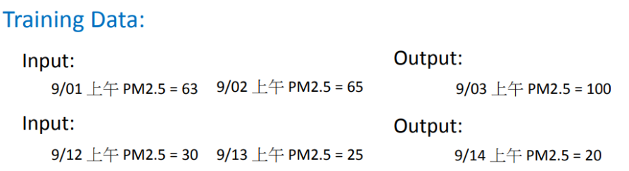
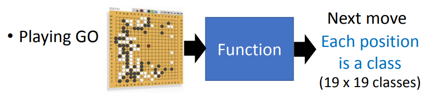
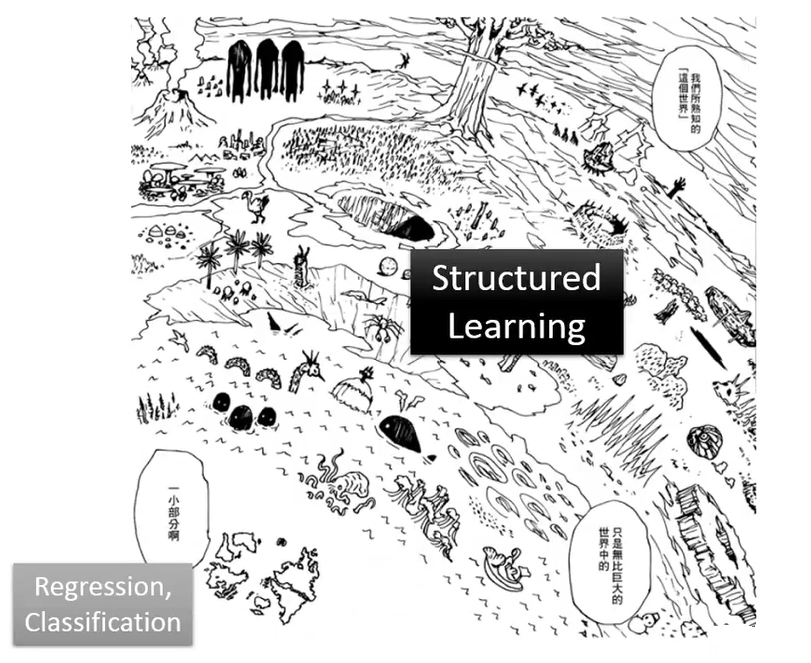
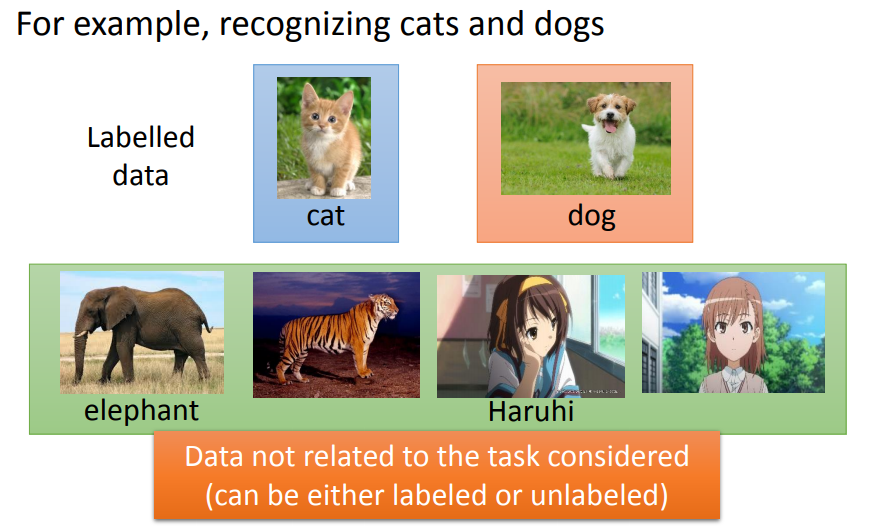

# <!-- fit --> 李宏毅机器学习笔记

---

# 绪

> **机器学习(个人理解):让机器具有学习的能力.**

> 辨析:人工智能、机器学习、深度学习之间的关系?

---

# <!-- fit--> 人工智能、机器学习、深度学习之间的关系

1. 人工智能是目标
2. 机器学习是实现人工智能的是手段
3. 深度学习是实现机器学习的一种方法

---

# 梗知识

假设你想要做一个聊天机器人,如果你不是使用机器学习的方式,而是给他天生的本能,即给它设定好规则,它可以帮你打开或者关掉音乐,那你的做法可能是:设立一条规则,如果输入的句子里面看到“turn off”这个词汇，那 chat-bot 要做的事情就是把音乐关掉。这个时候，你之后对 chat-bot 说，Please turn off the music 或 can you turn off the music, Smart? 它就会帮你把音乐关掉。看起来好像很聪明。别人就会觉得果然这就是人工智慧。但是如果你今天想要欺负 chat-bot 的话，你就可以说 please don‘t turn off the music，但是他还是会把音乐关掉。这是个真实的例子，你可以看看你身边有没有这种类似的 chat-bot，然后你去真的对他说这种故意欺负它的话，它其实是会答错的。

---

# 梗知识

使用人为设定的规则的话,它的坏处是没办法考虑到所有的可能性,它非常的僵化.人类想不到的东西,就没办法写规则,没有写规则,机器就不知道怎么办.它只能按照人为设定的规则来进行行为.如果是这样的话,它就没办法超越人类.

 
你可能会说，但是你好像看到很多聊天机器人看起来非常的聪明。如果是一个非常大的企业，他可以派成千上万的工程师，用血汗的方式来建出数以万计的规则，然后让他的机器看起来好像很聪明。但是对于中小企业来说，这样建规则的方式反而是不利的。所以机器学习发展，对比较小规模企业反而是更有利的。因为接下来，不需要非常大量的人来帮你想各式各样的规则，只要手上有数据，你可以让机器来帮你做这件事情。当然怎么收集数据又是另外一个问题，这不是我们今天要讨论的主题.

---

# 梗知识

</img>

---

### 为了让机器有自己学习的能力,我们要做的就是机器学习(_Machine Learning_)方向   简而言之,就是写段程序,让机器人变得很聪明,使它拥有学习的能力.

---

**如果更务实一点的话,机器学习所做的事情,你可以想成就是在寻找一个就函数,让机器拥有一个能力,这种能力是根据你给他的资料,它去寻找出我们要寻找的函数,很多关键问题都可以想成是我们就是需要一个函数.**

</img>

---

# 那我们怎么样找出这个函数?找出的函数的框架是什么?

&nbsp&nbsp&nbsp&nbsp&nbsp&nbsp&nbsp&nbsp我们以图像识别为例子,我们找个函数输入一张图片,它会告诉我们这个图片里面有什么样的东西

---

在做这件事时,我们需要先准备一个函数集和,举个例子,在这个函数集里面,有一个名为f1的函数,你给它看一只猫,它输出猫,看一只狗,它输出一只狗.
有一个f2很怪,你给它看猫,它就输出猴子,你给它看一只狗,它说是蛇.

 
 
 

## 总之,先假设你手上有一个函数集,这个函数集就叫做模型(_model_)

---

有了这个函数集之后,你会向其传入训练数据,这些训练数据会告诉机器一个好的函数,包括它的输入和输出应该是什么,有什么样的关系.

---

机器可以根据训练集判断一个函数是好的还是不好的.举例来说:在这个例子里显然f1比较符合训练集的叙述,所以f1相对较优.f2看起来是一个荒谬的函数.函数集里面,他有成千上万的函数,所以我们需要一个有效率的算法,从函数集里面挑出最好的函数。(一个一个衡量函数的好坏太花时间,实际上做不到.所以我们需要有一个好的演算法),从函数集里面挑出一个最好的的函数,将它记为f*

---

找到 f\*之后，我们希望用它应用到一些场景中,比如:影像辨识,输入一张在机器没有看过的猫,然后希望输出也是猫.你可能会说:机器在学习时没有看到这只猫，那咋样知道在测试时找到的最好函数可以正确辨识这只猫呢？这就是机器学习里面非常重要的问题:机器有举一反三的能力.

---

---

---

<!--backgroundColor: antiquewhite -->

# <!-- fit -->监督学习

---

## 回归问题

1. 回归问题是机器学习的任务之一,当我们说:我们要做回归时,意思就是机器找到函数,输出一个标量,这叫回归

- 举个例子来说,在作业里面,我们会让你对 PM2.5 进行预测,比如说预测明天上午的 PM2.5.你给它的咨询可能是今天上午的、昨天上午的等等.这是一个函数,你给它过去 PM2.5 的数据,它能预测未来的 PM2.5.如果你给的数据足够庞大,那么足以做出气象预报系统.

---

## 分类问题

1. 分类问题是机器学习的任务之一,在分类任务里面相比较于回归问题,不同的是机器输出的是类别.假设分类问题分为两种,一种叫做二分类,输出的是是或者否;另一类叫做多分类,在多分类任务中是让机器做一个选择题,等于是给他数个选项,每个选项都有一个类别,让它从数个类别里选择正确的类别.

- 举个例子来说
- 二分类可以鉴别垃圾邮箱.
- 多酚类可对文章进行分类,机器可以自动帮一沓新闻做分类

---

## 深度学习

  解决任务的第一步就是选择函数集,选不同的函数集,就是选择不同的模型.模型有很多种,最简单的就是线性模型,我们主要研究非线性模型.在非线性模型中最耳熟能详的就是深度学习.

用深度学习的技术可以让机器人下围棋,下围棋这个任务其实就是一个分类问日,对分类问题我们需要一个很复杂的函数,输入是一个棋盘的格子,输出的是下一步应该落子的位置.我们知道一个棋盘上有十九乘十九的位置可以落子,所以下围棋这个任务,我们就可以想象成是一个十九乘十九个类别的分类问题,或者可以想成是一个十九乘十九个选项的选择题.

---

## 结构化学习

## 监督学习还包括**结构化学习**

---

**其实很多人听说过回归和分类任务,但是可能没 1 听说过结构化学习,很多教科书都直接说,机器学习是两大类的问题,回归和分类.机器学习只有回归和分类两类问题,就好像告诉你:我们所熟知的世界只有五大洲,但是这只是真实世界的一小部分,真正的世界是如图所示。**

**这里面还有很多问题是没有探究的**

---

<!-- backgroundColor: azure-->

# <!--fit--> 半监督学习

---

监督学习的问题是我们需要大量的训练集.训练集告诉我们要找的函数的输入和输出之间的关系.如果我们在监督学习下进行学习,我们要告诉机器函数的输入和输出是什么.这个输出往往没有办法用很自然的方式取得,需要人工的力量把它标注出来,这些函数的输出叫做**标签**

# 
那么有没有办法减少标签的需求量? 这就是半监督学习

---

# 迁移学习

<text>
  迁移学习的意思是：假设我们要做猫和狗的分类问题，我们也一样，只有少量的有标签的数据。但是我们现在有大量的数据，这些大量的数据中可能有标签也可能没有标签。但是他跟我们现在要考虑的问题是没有什么特别的关系的，我们要分辨的是猫和狗的不同，但是这边有一大堆其他动物的图片还是动画图片（凉宫春日，御坂美琴）你有这一大堆不相干的图片，它到底可以带来什么帮助。这个就是迁移学习要讲的问题。
</text>

---

<!--backgroundColor: aquamarine-->

# <!--fit--> 无监督学习

---

## 
更加进阶的是无监督学习,我们希望机器可以学到无师自通

---

<!--backgroundColor: cornflowerblue-->

# <!--fit--> 强化学习

---

# 
我们将强化学习和监督学习进行比较

---

<big>**在监督学习中,我们会告诉机器正确答案是什么,若现在我们用监督学习的方法来训练一个聊天机器人模拟的训练方式会是:你就告诉机器,现在使用者我说了 Hello,你就说 Hi,现在使用者说课 byebye,你就说 good bye.所以机器有一个人当他的家教在旁边手把手的教他每件事,这就是监督学习**</big>

---

<big>**在强化学习中,我们没有告诉机器正确的答案是什么,机器所拥有的只有一个分数,就是它做的好还是坏**</big>
