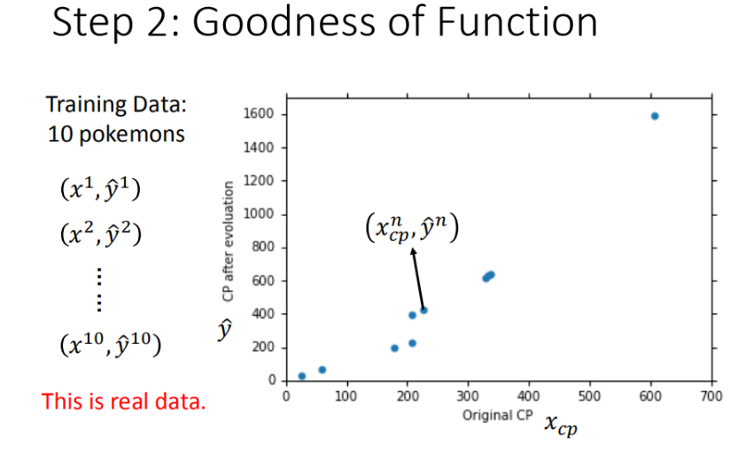
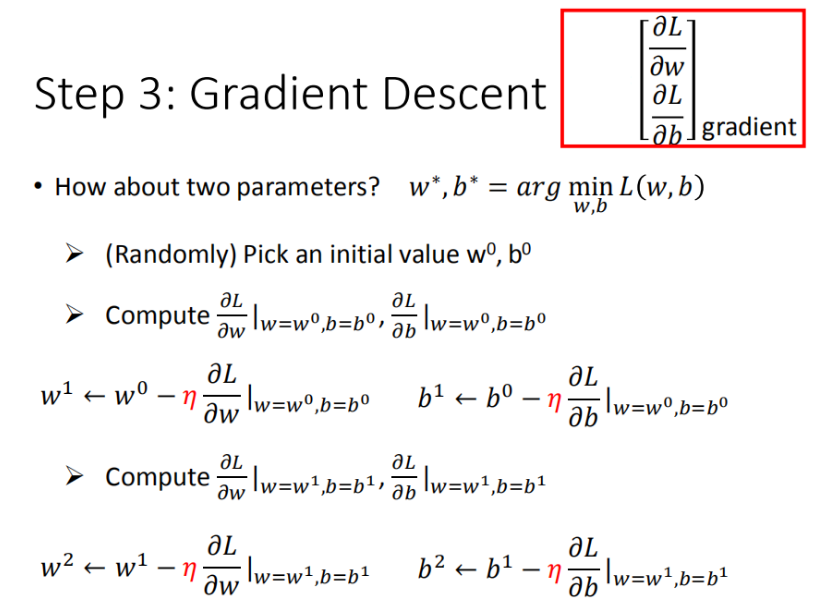
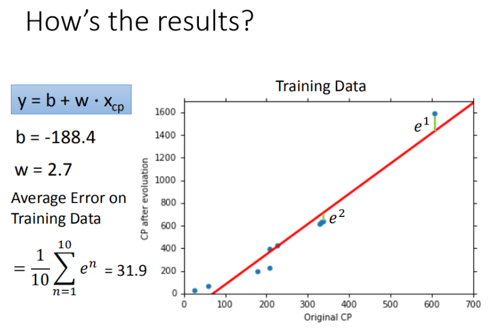
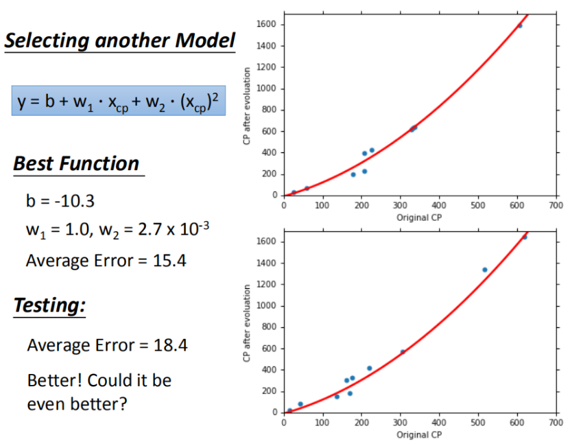
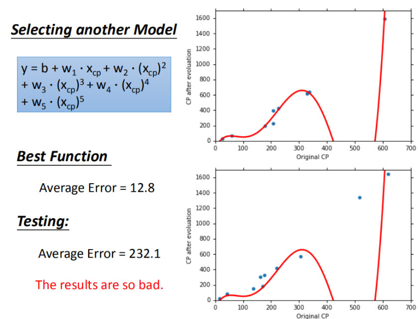
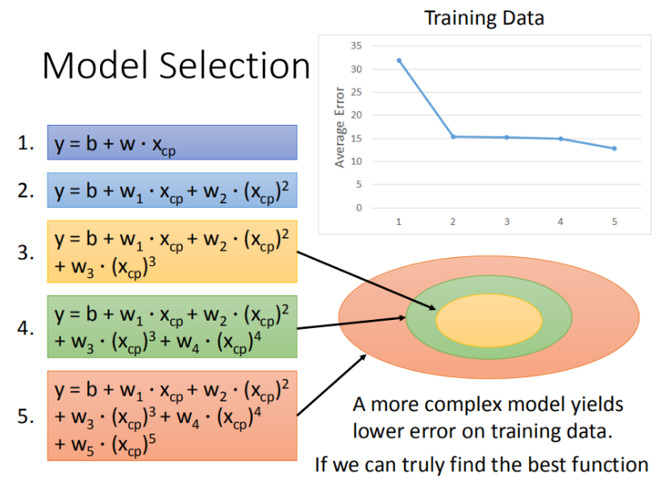
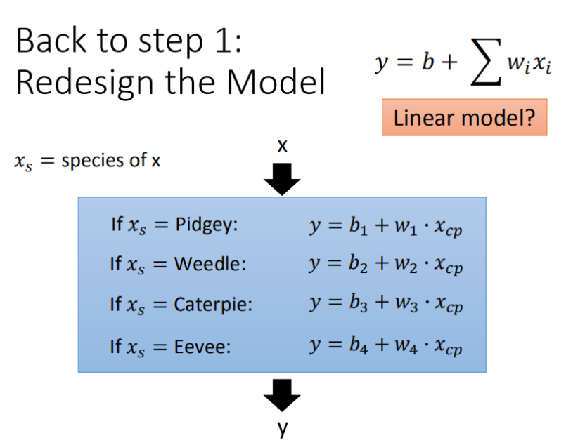

# 第三章 回归

## 回归

> 找到一个函数,通过输入特征$x$输出一个数值.

- [x] Task01：参照开源文档，观看视频 P1-2：机器学习介绍
- [x] Task02：参照开源文档，观看视频 P3-4：回归
- [ ] Task03：参照开源文档，观看视频 P5-8：误差和梯度下降
- [ ] Task04：参照开源文档，观看视频 P13：深度学习介绍和反向传播机制
- [ ] Task05：观看 2021 版视频 视频 P5-9：网络设计的技巧
- [ ] Task06：参照开源文档，观看视频 P21：卷积神经网络

---

## 应用举例

1. 股市预测
   - 输入:过去十年过票的变动,新闻咨询,公司并购咨询等
   - 输出:预测故事明天的平均值
2. 自动驾驶
   - 输入:无人车上各个传感器的数据
   - 输出:方向盘的角度
3. 商品推荐
   - 输入:商品 A 的特性,商品 B 的特性
   - 输出:购买商品 B 的可能性
4. 宝可梦精灵攻击力预测
   - 输入:进化前的攻击力,物种,血量,重量,高度.
   - 输出:进化后的攻击力

---

## 模型步骤

1. 模型假设 : **选择**模型框架(**线性模型**)
2. 模型评估 : **判断**众多模型的好坏(**损失函数**)
3. 模型优化 : **筛选**最优的模型(**梯度下降**)

### step.1 模型假设 - 线性模型

#### **一元线性模型**(单个特征)

以一个特征 $x_{cp}$ 为例子,线性模型假设 $y = b + w * x_{cp}$ ,所以 $w$ 和 $b$ 可以猜测很多模型 :

$$f_1: y = 10.0 + 9.0 \times x_{cp}$$
$$f_2: y = 9.8 + 9.2 \times x_{cp}$$
$$f_3: y = -0.8 -1.2 \times x_{cp}$$

虽然可以做出很多假设,但是对于$f_3: y = -0.8 -1.2 \times x_{cp}$的假设是不合理的!

#### **多元线性模型**(多个特征)

在实际应用中,输入特征肯定不止$x_{cp}$这一个.反正特征值会有很多.

所以我们假设 **线性模型**:$y =b+\sum{w_ix_i}$

- $x_i$ : 各种特征:
- $w_i$ : 各种特征的权重
- $b$ : 偏移量

### step.2 模型评估 - 损失函数

单个特征: $x_{cp}$

#### 收集和查看训练数据

这里定义$x^1$是进化前的攻击力,$\widehat{y^1}$为进化后的攻击力,$\widehat{y}$代表的是真实值.

将 10 组原始数据在二维坐标系内展示, 图中的每一个点($x_{cp}^n$,$\widehat{y}^n$)对应着进化前的攻击力和进化后的攻击力.

#### 如何判断众多函数的好坏呢

从 **数学** 的角度来讲,我们使用距离.求出进化前的攻击力和模型预测的攻击力的差值,来判定模型的好坏.也就是说我们使用了损失函数来衡量模型的好坏,统计 10 组原数据$(\widehat{y}^n - f({x_{cp}^n}))^2$的和,和越小,则模型越好.

公式推导过程 :

$$
\begin{align}
   L(f) &= \sum_{n=1}^{10}(\widehat{y}^n - f(x_{cp}^n))^2\\
        &= \sum_{n=1}^{10}(\widehat{y}^n - (b + w \times x_{cp}))^2\\
\end{align}
$$

最终定义损失函数:
$$L(w,b) =\sum_{n=1}^{10}(\widehat{y}^n - (b + w \times x_{cp}))^2$$

我们将$w,b$在二位坐标图中展示,如图所示:

- 图中的每一个点代表着一个模型的$w$和$b$
- 颜色越深代表模型越优

### step.3 最佳模型 - 梯度下降

单个特征: $x_{cp}$

#### 如何筛选最优的模型

$$
\begin{align}
    f^{*}     &= \argmin\limits_{x} L(f)\\
    w^*,b^* &= \argmin\limits_{w,b}L(w,b)\\
                      &=\argmin\limits_{w,b}\sum_{n=1}^{10}{(\widehat{y}^2 - (b +  w \cdot{c_{cp}^n}))^2}\\
\end{align}
$$

- 我们先从最简单的参数$w$入手,定义$w^* = \argmin\limits_{x}L(w)$

首先在这里引入一个概念 **学习率** : 移动的步长,如上图$\eta$

步骤:

1. 随机选取一个$w^0$
2. 计算微分,也就是当前的斜率,根据斜率判断移动的方向
   - 大于 0 就向右移动(增加$w$)
   - 小于 0 就向左移动(减小$w$)
3. 根据学习率移动
4. 重复步骤 2 和 3 ,直到找到最低点.

> 步骤 1 中我们随机选取了一个 $w^0$ ,如上图所示,我们找到的$w^*$是局部最优解,但并不是全局最优解,这里先保留疑问,后面解决.

- 我们再从两个参数$w$和$b$入手.

其实这个过程是类似的,只不过我们需要做的是求偏微分

#### 梯度下降推演最优模型的过程

如果把 $w$ 和 $b$ 在图形中展示出来:

- 每一条线圈围成的圈就是等高线,代表损失函数的值,颜色越深的区域代表的损失函数越小
- 个红色的箭头代表等高线的法线方向

---

## 如何验证训练好的模型的好坏

使用训练集和测试集的平均误差来验证模型的好坏

如图所示:

然后再使用测试集测试模型,求得平均误差为 35.0

如图所示:

---

## 更强大复杂的模型: 一元 N 次线性模型

在模型上，我们还可以进一步优化，选择更复杂的模型，使用一元二次方程举例，如下图，发现训练集求得平均误差为 15.4，测试集的平均误差为 18.4

这里我们提出一个新的问题: 是不是能画出直线就是线性模型,各种复杂的曲线就是线性模型?

> 其实还是线性模型,因为把$x_{cp}^1 = (x_{cp})^2$,那么 $y = b + w_1 \cdot x_{cp} + w_2 \cdot x_{cp}^1$ 其实就是线性模型

---

## 过拟合问题的出现

在模型上,我们可以再进一步优化,使用更高次方的模型

- 训练集平均误差[15.4 , 15.3 , 14.9 , 12.8]

- 测试集平均误差[18.4 , 18.1 , 28.8 , 232.1]

三次模型

四次模型

五次模型

- 在上面的三个图上,发现在训练集上面表现优秀的模型,为什么在测试集上效果反而差了?这就是模型在训练集上**过拟合**的问题

如图所示,每一个模型结果都是一个集合,三次模型 $\subseteq$ 四次模型 $\subseteq$ 五次模型

所以在四次模型里面找到的最佳模型肯定不会比五次模型里面找的更差

如下图,将错误率图形化展示,发现三次方以上的模型已经出现了过拟合的现象.

## 步骤优化

1. 将线性模型合并到一个线性模型中

2. 更多参数,更多输入
3. 加入正则化
   - 更多的特征,但是权重$w$可能会使某些特征权值过高,仍旧导致过拟合,所以加入正则化
